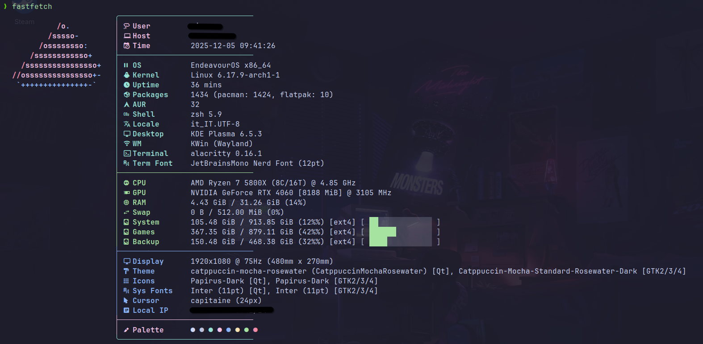

# ⚡ Gold Fastfetch Nvidia Config

A highly customized, performance-oriented **Fastfetch** configuration file (`fastfetch.jsonc`).
Designed for **Arch Linux / EndeavourOS** users with **Nvidia GPUs**, focusing on data density, visual hierarchy, and hardware monitoring accuracy.



---

## 🚀 Key Features

- **Nvidia SMI-based monitoring:** Uses `nvidia-smi` + `awk` to fetch GPU name, VRAM and real-time temperature.
- **Storage visuals:** Displays usage bars, percentage and filesystem type (ext4/btrfs) for Root, Games and Backup mounts.
- **Split package management:** Separates **Pacman**, **Flatpak** and **AUR** counts (via `pacman -Qm`) for a cleaner software overview.
- **Media integration:** Shows current player and now playing track (Spotify, VLC, etc.) when active.
- **Gold master layout:**
  - **Header:** User, hostname, and timestamp with cyan & magenta styling.
  - **Software:** OS, kernel, packages, shell, locale, DE/WM, terminal and fonts.
  - **Hardware:** Green section with CPU, GPU temperature, RAM/Swap percentages.
  - **Storage:** Disk usage with visual bars for system, games and backup partitions.
  - **Misc:** Blue section including display, audio, theme, icons, system fonts, cursor, gamepad, local IP and media player.
- **Zero "chartjunk":** Optimized format strings to remove redundant text while keeping essential data visible.

---

## 📦 Requirements

- **Fastfetch** (latest version recommended)
- **Nvidia drivers** (with `nvidia-smi` available in `PATH`)
- A **Nerd Font** (e.g. *JetBrainsMono Nerd Font*) for correct glyph rendering
- `pacman` (for package counting logic)

---

## 📥 Installation

### Method 1: Manual copy (recommended)

This is the safest method. It creates a standalone copy of the config.

1. **Clone the repository:**
```bash
   git clone https://github.com/Lucenx9/Gold-Fastfetch-Nvidia.git
   cd Gold-Fastfetch-Nvidia
```

2. **Back up your existing config (if any):**
```bash
   mv ~/.config/fastfetch/config.jsonc ~/.config/fastfetch/config.jsonc.bak 2>/dev/null
```

3. **Install the new config:**
```bash
   mkdir -p ~/.config/fastfetch
   cp fastfetch.jsonc ~/.config/fastfetch/config.jsonc
```

### Method 2: Symlink (for dotfiles managers)

Advanced users can link the file directly to receive updates via `git pull`.
```bash
ln -sf ~/path/to/Gold-Fastfetch-Nvidia/fastfetch.jsonc ~/.config/fastfetch/config.jsonc
```

---

## 🔧 Customization Notes

### Disk mounts

The config is hardcoded for a specific mount setup.
Edit the disk modules in `fastfetch.jsonc` to match your `lsblk` / actual mount points:
```json
{
  "type": "disk",
  "key": "│ 󰋊 Games",
  "folders": "/mnt/games",
  ...
}
```

### Optional modules

Some modules only appear when relevant:
- **Gamepad:** Only shows when a controller is connected
- **Player/Media:** Only shows when music is playing
- **Battery:** Remove if using a desktop PC

---

## 📜 License

Unlicense / Public Domain.

Feel free to fork, modify and steal parts of this config for your own setup.
Feel free to open an issue or PR if you want to extend support to other distros, layouts or GPU vendors.
